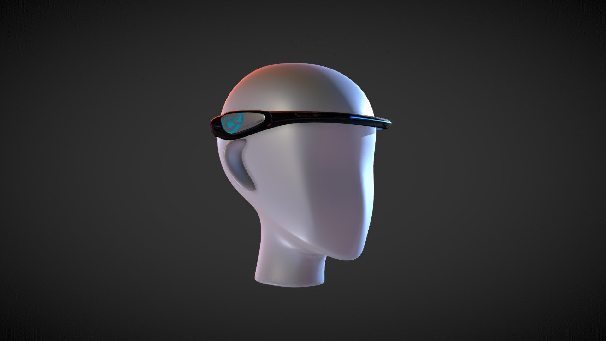
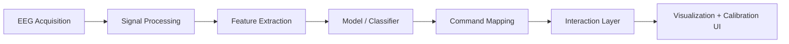
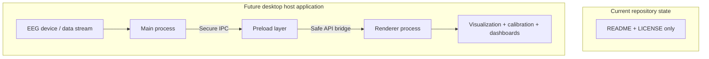
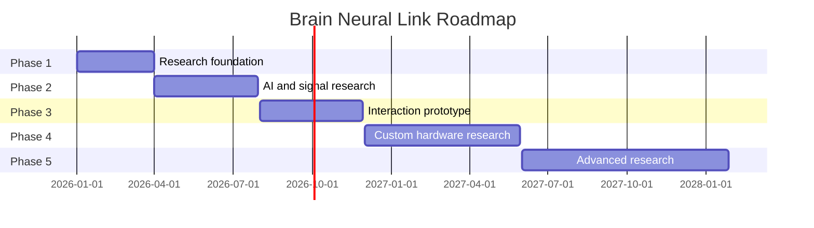
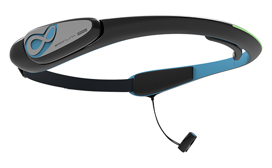
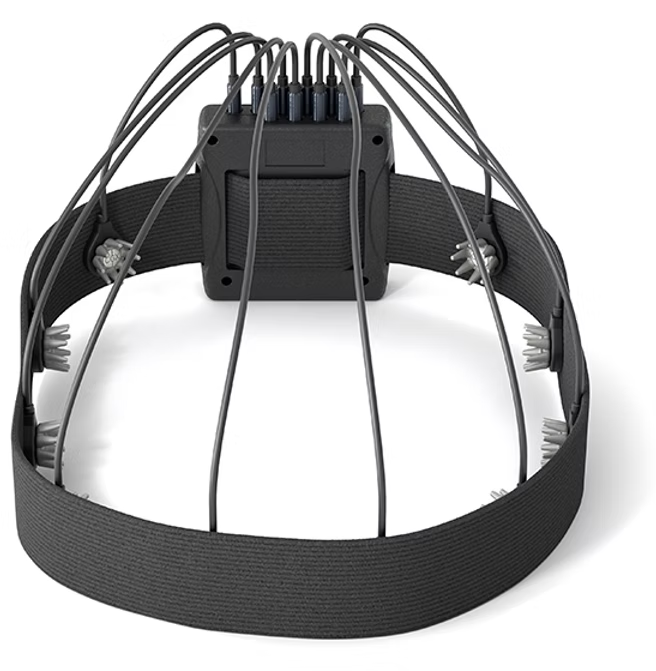

# Brain Neural Link

<p align="center">
  
</p>
  
</p>

### CGX

CGX is relevant as a benchmark in research-grade, dry-electrode EEG systems.

### BrainLink Pro

BrainLink Pro is relevant as an example of a possible affordable or accessible non-invasive EEG research platform.

## Project Tagline

Building a practical, non-invasive brain-computer interface research platform for hands-free interaction, accessibility exploration, and future wearable EEG applications.

## Introduction

Brain Neural Link is an experimental research project focused on non-invasive Brain-Computer Interface (BCI) development. The long-term aim is to explore lightweight, removable, portable wearable systems that capture brain activity using external EEG sensors and translate measurable patterns into digital commands.

This repository currently serves as the project foundation and documentation hub. At the moment, it contains the project identity, licensing, and roadmap artifacts rather than a complete application implementation. That is important: the work is intentionally framed as research and prototype development, not as a completed medical or commercial product.

## Why Brain Neural Link?

The project explores future methods of interacting with technology without relying entirely on touchscreens, keyboards, mice, touchpads, and conventional physical controls.

The core motivation is twofold:

- Accessibility research for people who may have difficulty using traditional physical interfaces
- More natural, hands-free interaction for everyday devices and digital experiences

The project does not claim to read every thought or to replace all forms of human movement. It focuses on measurable EEG signals, practical interaction experiments, and gradual reliability improvements.

> Start small. Prove one reliable interaction. Improve accuracy. Expand gradually.

## Vision

The long-term vision is to create a comfortable, portable, lightweight, removable, and aesthetically designed wearable device that assists with touch-free interaction using external EEG sensing. The system is expected to evolve from research-grade experimentation toward a wearable prototype that can support a limited set of reliable commands.

## Core Concept

Brain Neural Link is intentionally designed around a realistic development path:

```text
Brain Activity
      ↓
Non-Invasive EEG Sensors
      ↓
Signal Amplification / Analog Front End
      ↓
Filtering and Signal Conditioning
      ↓
Analog-to-Digital Conversion
      ↓
Digital EEG Data
      ↓
Bluetooth / Wireless Communication
      ↓
Signal Processing
      ↓
AI / Machine Learning
      ↓
Pattern / Intent Classification
      ↓
Digital Command
      ↓
Device Interaction
```

This is a research-oriented interpretation of the signal pipeline and should be read as a conceptual system architecture rather than a claim of an already-built device.

## System Architecture

```mermaid
flowchart LR
    A[Brain activity] --> B[Non-invasive EEG sensors]
    B --> C[Analog front end]
    C --> D[Filtering and conditioning]
    D --> E[ADC]
    E --> F[Digital EEG stream]
    F --> G[Wireless transmission]
    G --> H[Signal processing]
    H --> I[AI / ML model]
    I --> J[Pattern classification]
    J --> K[Command output]
    K --> L[Device interaction]
```



## Current Project Status

This repository currently contains only:

- `README.md`
- `LICENSE`

There is no production application code, no `package.json`, no Electron source tree, no hardware firmware, and no ML pipeline in the repository yet. As a result, the repository should be treated as a project foundation and conceptual specification rather than a completed implementation.

| Status | Description |
| --- | --- |
| Currently implemented | Project identity, documentation, MIT license, and conceptual design direction |
| Prototype features | EEG acquisition experiments, calibration workflows, signal classification prototypes, UI dashboards |
| Planned features | Wearable hardware design, wireless acquisition, command mapping, desktop host tools |
| Long-term research goals | Accessibility-focused hands-free interaction, low-power wearable hardware, improved personalization |

## Features

### Currently implemented

At the moment, the repository has no executable software or hardware implementation. The only concrete artifact is the project documentation itself.

### Prototype features

The following are conceptual prototype directions and should be treated as research possibilities, not confirmed implemented features:

- Navigation experiments
- Selection and scrolling tests
- Next/previous action mapping
- Custom command mapping
- Signal quality monitoring
- Real-time EEG visualization
- User calibration workflows
- Machine-learning experiments
- False-command reduction strategies

### Planned features

- Non-invasive dry electrode evaluation
- Signal acquisition and filtering pipelines
- Desktop or mobile monitoring tools
- Calibration routines for individual users
- Pattern-based command classification
- Open research interface for command experiments

### Long-term research goals

- Comfortable and portable wearable form factor
- More accessible input methods
- Reduced dependence on keyboards, mice, and touchpads
- Better hands-free control for digital systems
- Lower-cost research hardware exploration

## Hardware Architecture

The target hardware direction is a non-invasive, wearable EEG system intended to be more comfortable and less intrusive than clinical-grade laboratory setups.

A future wearable may include:

- Non-invasive dry EEG sensors
- Low-noise analog front-end electronics
- Signal conditioning stages
- High-resolution analog-to-digital conversion
- Low-power microcontroller or processor
- Bluetooth Low Energy or similar wireless communication
- Rechargeable battery
- Lightweight wearable enclosure

The product direction is meant to resemble a comfortable headband or headphone-inspired wearable rather than a large research lab EEG cap.

A key affordability strategy is to move computationally intensive AI processing to the user's existing smartphone or computer wherever appropriate, while the wearable stays focused on signal acquisition and transmission.

## Software Architecture

The current repository contains no application code, runtime, or package manifest. The software architecture is therefore conceptual and future-facing.

A plausible software direction would include:

- Device communication and acquisition layer
- Signal quality monitoring
- Filtering and preprocessing pipeline
- Feature extraction and classification engine
- Calibration and personal profile management
- Command mapping and interaction layer
- Visualization dashboard for researchers and developers



This architecture is a forward-looking model, not a description of a finished implementation.

## EEG Development Strategy

The project will likely begin by using existing EEG hardware for research and experimentation before moving toward custom hardware development. This is a practical and responsible strategy for understanding signal quality, user calibration, and interaction patterns without prematurely committing to a bespoke wearable design.

```text
Existing EEG Device
        ↓
Collect and Study EEG Data
        ↓
Signal Processing Software
        ↓
AI / Machine Learning Research
        ↓
Reliable Prototype Commands
        ↓
Custom Hardware Research
        ↓
Integrated Wearable Prototype
```

This approach helps evaluate:

- Signal quality
- Data collection workflows
- EEG processing techniques
- Machine learning experiments
- User calibration needs
- BCI interaction reliability

The project does not imply copying or reproducing any commercial EEG device. It is a separate research effort exploring a non-invasive soft-hardware path.

## Technology and Research Landscape

### CGX

CGX is relevant as a benchmark in research-grade, dry-electrode EEG systems. This project is conceptually interested in similar directions, including dry EEG electrode strategies, multi-channel acquisition, low-noise electronics, high-resolution analog-to-digital conversion, wireless communication, and raw EEG data access.

This project is not affiliated with CGX, and the comparison is strictly for technical and research context.

### BrainLink Pro

BrainLink Pro is relevant as an example of a possible affordable or accessible non-invasive EEG research platform. Depending on SDK or API availability, it may serve as a useful research comparison point or prototyping reference. However, BrainLink Pro is not part of Brain Neural Link unless actual integration code is added in the future.

### Neuralink

Neuralink represents an implanted BCI approach and is therefore conceptually different from Brain Neural Link. Brain Neural Link is intended to explore a non-invasive, external, removable, and portable path.

This project does not claim neural resolution or invasive implant capabilities comparable to Neuralink.

### Brain Products / BrainVision

Brain Products and BrainVision are relevant to the broader EEG and neurophysiology ecosystem. Their importance to this project lies in EEG recording, signal visualization, data analysis, and experimental research workflows. They are used as contextual references for the broader science and engineering environment, not as a project affiliation.

## Electron Integration

The current repository does not contain any Electron source files, configuration, or application logic. There is no implemented Electron application in this codebase yet.

If Electron is added later, it would most likely serve a desktop host role for:

- Real-time EEG signal visualization
- Device communication and diagnostics
- Calibration utilities
- Research dashboards
- AI workflow monitoring
- Command testing and prototyping

The real architecture in this repository is currently limited to project documentation, so any Electron architecture must be treated as a future, conceptual design rather than an implemented feature.

### Conceptual Electron architecture



This diagram describes a hypothetical architecture for future development and should not be read as evidence of existing implementation.

## AI and Machine Learning

AI is expected to play a critical role in interpreting EEG signal features, not in reading unrestricted thoughts. The project should treat AI as a tool for pattern recognition, signal classification, and confidence estimation.

```text
Raw EEG Data
      ↓
Signal Cleaning
      ↓
Noise / Artifact Handling
      ↓
Feature Extraction
      ↓
Machine Learning Model
      ↓
Pattern Classification
      ↓
Confidence Evaluation
      ↓
Command Output
```

Conceptual research topics may include:

- Personalized calibration
- Feature extraction from EEG data
- Classification models for discrete commands
- Adaptive user-specific tuning
- Real-time inference
- Confidence thresholds and false-positive reduction

These are forward-looking research areas and should not be presented as current capabilities.

## Design Philosophy

The visual and physical product direction emphasizes:

- Lightweight
- Comfortable
- Easy to wear
- Easy to remove
- Portable
- Minimal
- Modern
- Futuristic
- Aesthetically appealing
- Practical
- Affordable where possible

The product vision is serious and grounded in engineering realism. Brain Neural Link is framed as a future research platform, not science fiction.

## Target Price

> **Target estimated price: NPR 100,000–200,000 (approximately 1–2 lakh Nepali rupees)**

This estimate is a development and product target, not a confirmed manufacturing price. Actual costs may depend on:

- EEG channel count
- Sensor technology
- Analog front-end components
- ADC specifications
- Wireless hardware
- Battery
- Mechanical design
- Manufacturing volume
- Software development
- Testing
- Regulatory and certification requirements

The goal is to explore a realistic cost range for a research prototype and future development path, not to promise a final commercial price.

## Future Vision

### Phase 1 — Research Foundation

- EEG device evaluation
- Signal acquisition
- Data collection
- Signal visualization
- Software foundation

### Phase 2 — AI Research

- Signal processing
- Feature extraction
- Classification models
- Calibration
- Reliability testing

### Phase 3 — Interaction Prototype

- Small command set
- Navigation experiments
- Selection experiments
- Device interaction research

### Phase 4 — Custom Hardware

- Custom sensor research
- EEG electronics research
- Lightweight wearable design
- Battery optimization
- Wireless communication

### Phase 5 — Advanced Future Research

Long-term goals may include:

- More natural interaction
- More reliable hands-free communication interfaces
- Reduced dependence on spoken or typed input
- Improved accessibility
- Better personalization
- Smaller and more comfortable hardware
- Lower-cost manufacturing

These remain research goals and not currently available features.



## Required README Structure

This README is organized around the required project structure to provide an honest and professional foundation for the repository:

1. Hero Section
2. Project Tagline
3. Introduction
4. Why Brain Neural Link?
5. Vision
6. Core Concept
7. System Architecture
8. Current Project Status
9. Features
10. Hardware Architecture
11. Software Architecture
12. Electron Architecture
13. AI and Machine Learning
14. Development Strategy
15. Technology Landscape
16. Design Philosophy
17. Target Price
18. Repository Structure
19. Installation
20. Development
21. Configuration
22. Screenshots / Demo
23. Roadmap
24. Research Limitations
25. Safety and Responsible Development
26. Contributing
27. Disclaimer
28. License

## Repository Structure

The repository currently contains the project documentation and reference hardware assets:

```text
.
├── LICENSE
├── README.md
└── assets/
    ├── images/
    │   ├── Brain-Link-Pro.png
    │   ├── BrainlinkPro-3D.jpeg
    │   └── CGX-Dev-Kit.png
    └── manual/
        └── EEG Dev Kit.pdf
```
[View the CGX EEG Development Kit Manual](assets/manual/EEG%20Dev%20Kit.pdf)

For the image section, you can now use the actual paths:

```markdown
### Reference Hardware

<p align="center">
  
  
  
</p>
```


## Installation

No installation steps are currently defined because this repository does not yet include a packaged application, package manifest, build system, or executable software.

When the project reaches a concrete implementation stage, installation and setup instructions will be added to reflect the actual tooling and dependencies.

## Development

The repository is currently a research and documentation foundation. Development work is expected to evolve into the following categories:

- EEG acquisition and testing
- Signal processing research
- Machine learning experiments
- UI and dashboard development
- Wearable hardware design evaluation
- Prototype interaction testing

## Configuration

No application configuration exists yet. This repository does not include a current runtime configuration file, environment setup, or build pipeline.


## Research Limitations

Brain Neural Link is a research effort and should be treated accordingly:

- Non-invasive EEG signals are noisy and variable
- Individual calibration is often required
- Real-world accuracy is not guaranteed
- Command reliability must be proven progressively
- A system should be validated with user-specific testing
- The project should not claim direct mind reading or full-device control

## Safety and Responsible Development

This project must be developed responsibly and with realistic scientific boundaries.

- Do not claim medical diagnosis or treatment outcomes
- Do not claim to read thoughts or decode all intent
- Focus on measurable, testable EEG-based interactions
- Prioritize user comfort and safety
- Treat all prototype systems as research tools
- Validate research with appropriate testing, calibration, and transparency

## Contributing

Contributions are welcome once the project moves beyond the current conceptual phase. At present, the repository is primarily a foundation for research direction and design documentation.

Future contributions may include:

- Signal-processing experiments
- Data collection tooling
- Calibration scripts
- Machine learning prototypes
- Device interface exploration
- Documentation improvements
- Research notes and validation results

## Disclaimer

Brain Neural Link is an experimental research project exploring non-invasive BCI concepts. It is not a medical device, not a proven clinical system, and not a guarantee of universal accessibility or mind-reading capability.

The project goal is to investigate practical, measurable interaction patterns through EEG signals and to improve the reliability of a small set of commands over time.

## License

This project is licensed under the [MIT License](LICENSE).

---

<div align="center">
  <strong>Brain Neural Link</strong><br />
  Experimental non-invasive EEG research for future hands-free interaction.
</div>
